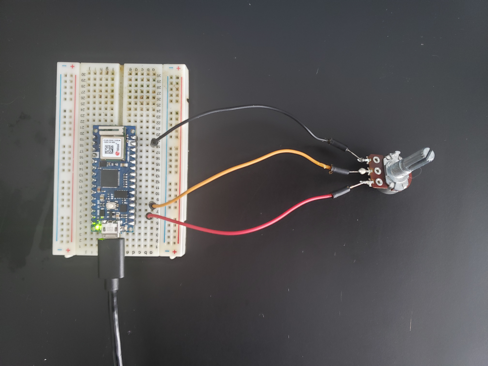

# Fast-Fun
Working Github repo for the Spring 2021 ITP Class "Fast Fun: Physical Controllers for Unity"

This is where code examples will be hosted, with new files added as the class continues.

## Analog Read and MIDI CC

I'm adding a new Arduino program to the repo: "SmoothedAnalog_CC-MIDI". In this sketch there is a link to a corresponding p5js/Webmidi.js sketch that can be used with it. It can also be used with any program that can receive MIDI CC messages from CC1 and CC2.

To wire one analog sensor, like a potentiometer to your Nano 33 IoT, you would wire it like this:

With some of the common joystick components, you get two potentiometers. The wiring is similar, with each output going to a different analog input on the Nano. NOTE: your joystick may say "5v". DON'T attach your Nano's 5v to this- instead use the Nano's 3.3v pin, like so:

This is because the Nano operates on 3.3v for it's inputs. The labeling on the joystick was chosen because 5v has traditionally been more common- but that pin is simply for the positive voltage. The 3.3v will work fine and has been tested to work.

Hopefully this helps, along with the email I sent out about smoothing analog reading data. That blog post can be found here:
https://maker.pro/arduino/tutorial/how-to-clean-up-noisy-sensor-data-with-a-moving-average-filter

## A more controlled keyboard

With the built in keyboard and mouse examples, the keyboard buttons you are pressing can be "pressed" dozens of times in a brief instant. How do we slow this down? What are other ways of using the keyboard?

New Arduino example "USB_Keyboard-Press_Release" walks you through different strategies. We can use the delay() function to slow down the overall speed of the sketch. However, we can also break down the action of "pressing" a key: the moment we press it and then moment we release it. A "press and hold" interaction may be more useful than repeated tapping for as long as an electrical connection is made.

Look at the keyboard library reference here:
https://www.arduino.cc/reference/en/language/functions/usb/keyboard/

and the section about pressing includes releasing as well:
https://www.arduino.cc/reference/en/language/functions/usb/keyboard/keyboardpress/

## Unity MIDI CC

I've update the Unity Example One project. If you go to the MIDI example scene, and open "midiBoxScript.cs", you'll see that I have added input for MIDI CC messages. These are currently setup to work with the "SmoothedAnalog_CC-MIDI" message above. Wire up a potentiometer to make the box spin!

## Your Arduino's "Pinout"

Which pins are which?! When you put the Nano in a breadboard, you can't see the pin lables anymore. Boo! But we have a diagram of the pins here. Yay!

https://content.arduino.cc/assets/Pinout-NANO33IoT_latest.png

